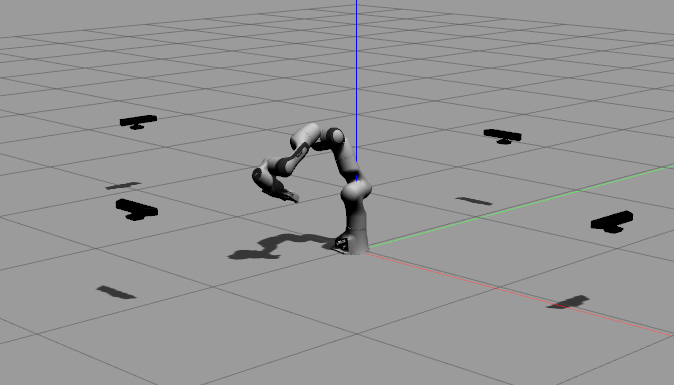
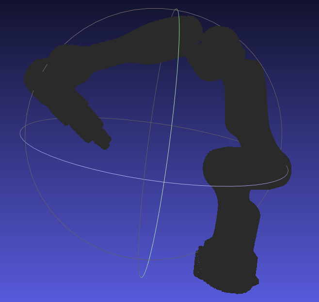
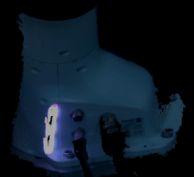
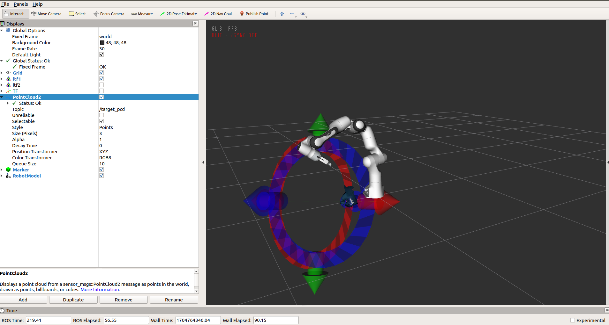

# handeye_calibration_by_ICP
This code implements hand-eye calibration using ICP and a depth camera, 
addressing both "eye-in-hand" and "eye-to-hand".


# Franka:

## Step 

- 首先通过rostopic echo /franka_joint 等获得每个关节的角度，
然后写入franka_ros/franks_gazebo/launch/panda_camera.launch中
的initial_joint_positions位置，这样可以使得gazebo中机器人位姿和实际是一样的。
下面是一个眼在手上的示例。

<br/>

- 然后运行下面代码可以获得四个相机的点云，注意1234是分开进行的。将四个点云分别命名为1.pcd,2.pcd,3.pcd,4.pcd


```shell
rosrun pcl_ros pointcloud_to_pcd /input:=/camera/depth/points1/2/3/4
```

- 然后运行下面代码，根据相机坐标将点云合在一起,获得整体点云，记得在meshlab中去掉地面

```shell
python readpointcloudsintopcd.py
  ```

<br/>

- 此外，还需要获得场景点云（realsense拍摄）

<br/>

- 下面进行手动粗糙配准和ICP的精配准。手动粗配准:
- 把场景点云的pcd(test.pcd)发布出来

```shell
rosrun pcl_ros pcd_to_pointcloud ./test.pcd 0.1 _frame_id:=camera_link cloud_pcd:=target_pcd
  ```

- 接着运行pyni写的[package](https://github.com/pyni/quick_depth_handeye_calibration_without_calibration_board) (rviz_interactive_tf),打开rviz，里面同时有场景点云和机器人关节姿态，注意该代码可能无法准确读取到机器人关节状态，可以增加一个robotmodel的topic，另外还要读入之前发布的target_pcd，然后手动调节

```shell
roslaunch rviz_interactive_tf calibrationpcdandmodel.launch
 ```
<br/>

- 把实际点云移动到一个好的初始位置，使用下面代码，得到相机在世界坐标系下面的姿态，读取translation和RPY，放入下面py文件并运行,得到camera_link相对于world的关系
```shell
rosrun tf tf_echo /world /camera_link
python icpcalibration.py
 ```
- 然后将这个结果发布出去
```shell
rosrun tf static_transform_publisher 0.34122564046845727 -0.2266843385859239 0.3278484599502524 -0.38861421549443614 0.6722147648448942 0.5504857574429056 -0.30671115449666625 /world /camera_link 50
 ```

- 根据机器人tf变换关系，订阅以下代码，获得标定位姿。一般是标定到link8上面

```shell
rosrun tf tf_echo /panda_link8 /camera_link
rosrun tf tf_echo /panda_K /camera_link
 ```

