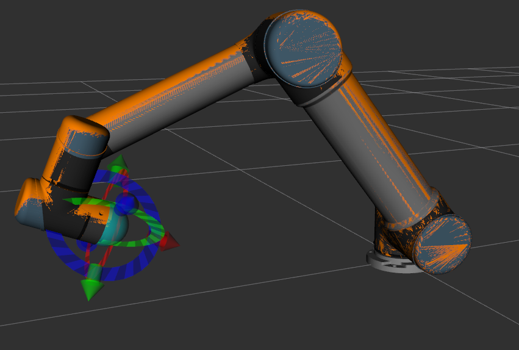
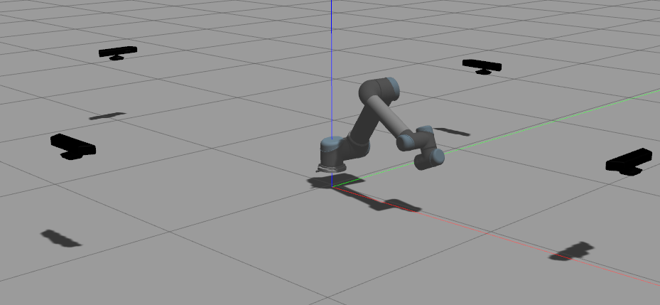
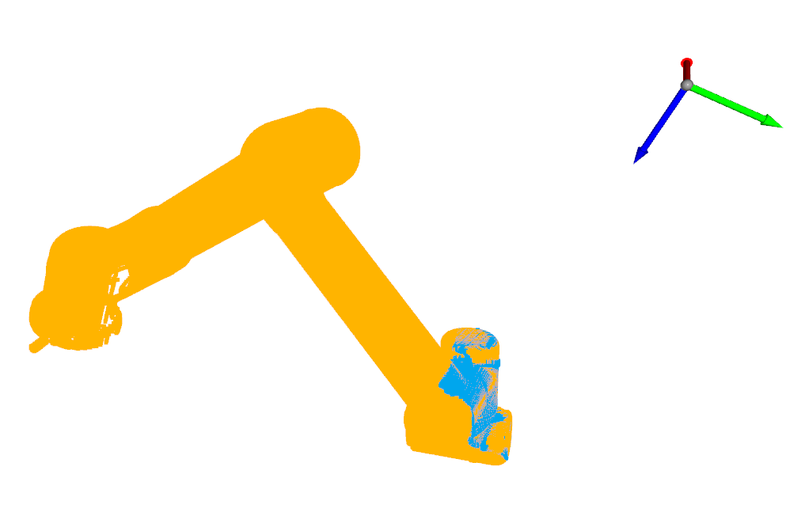
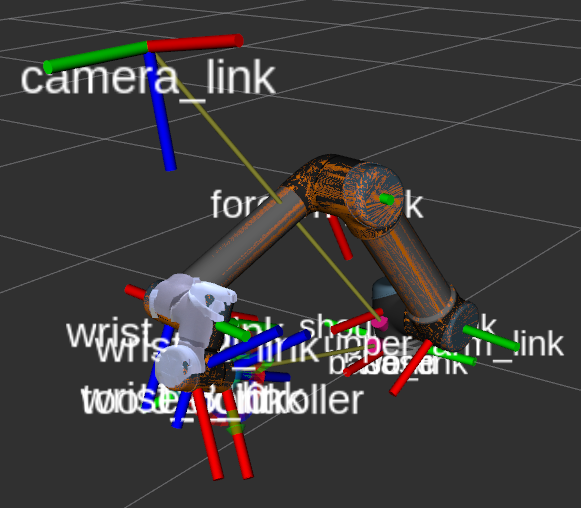

# handeye_calibration_by_ICP
This code implements hand-eye calibration using ICP and a depth camera, 
addressing both "eye-in-hand" and "eye-to-hand".

- This method is from [pyni](https://github.com/pyni)


# Franka:

## Step 

- 首先通过rostopic echo /franka_joint 等获得每个关节的角度，
然后写入franka_ros/franks_gazebo/launch/panda_camera.launch中
的initial_joint_positions位置，这样可以使得gazebo中机器人位姿和实际是一样的。
下面是一个眼在手上的示例。

<br/>

- 然后运行下面代码可以获得四个相机的点云，注意1234是分开进行的。将四个点云分别命名为1.pcd,2.pcd,3.pcd,4.pcd


```shell
rosrun pcl_ros pointcloud_to_pcd /input:=/camera/depth/points1/2/3/4
```

- 然后运行下面代码，根据相机坐标将点云合在一起,获得整体点云，记得在meshlab中去掉地面

```shell
python readpointcloudsintopcd.py
  ```

<br/>

- 此外，还需要获得场景点云（realsense拍摄）

<br/>

- 下面进行手动粗糙配准和ICP的精配准。手动粗配准:
- 把场景点云的pcd(test.pcd)发布出来

```shell
rosrun pcl_ros pcd_to_pointcloud ./test.pcd 0.1 _frame_id:=camera_link cloud_pcd:=target_pcd
  ```

- 接着运行pyni写的[package](https://github.com/pyni/quick_depth_handeye_calibration_without_calibration_board) (rviz_interactive_tf),打开rviz，里面同时有场景点云和机器人关节姿态，注意该代码可能无法准确读取到机器人关节状态，可以增加一个robotmodel的topic，另外还要读入之前发布的target_pcd，然后手动调节

```shell
roslaunch rviz_interactive_tf calibrationpcdandmodel.launch
 ```
<br/>

- 把实际点云移动到一个好的初始位置，使用下面代码，得到相机在世界坐标系下面的姿态，读取translation和RPY，放入下面py文件并运行,得到camera_link相对于world的关系
```shell
rosrun tf tf_echo /world /camera_link
python icpcalibration.py
 ```
- 然后将这个结果发布出去
```shell
rosrun tf static_transform_publisher 0.34122564046845727 -0.2266843385859239 0.3278484599502524 -0.38861421549443614 0.6722147648448942 0.5504857574429056 -0.30671115449666625 /world /camera_link 50
 ```

- 根据机器人tf变换关系，订阅以下代码，获得标定位姿。一般是标定到link8上面

```shell
rosrun tf tf_echo /panda_link8 /camera_link
rosrun tf tf_echo /panda_K /camera_link
 ```


# UR:

## Step 

- gazebo中加入四个相机
 ```
 将/ur_ws/src/universal_robot-melodic-devel/ur_gazebo/launch/ur5.launch中的
<arg name="world_name" default="worlds/empty.world"/>
更改为
<arg name="world_name" default="/home/sunh/catkin_ws/src/franka_ros/franka_gazebo/world/camera_only.world"/>
 ```

- 为了使得ur机器人能够在gazebo中得到一个和真实场景一样的姿态，先打开gazebo，然后rostopic list，查看发布的msg，发现
 ```
/arm_controller/follow_joint_trajectory/goal
然后运行
rostopic type /arm_controller/follow_joint_trajectory/goal
得到control_msgs/FollowJointTrajectoryActionGoal
在/UR/calibration_code/control_ur.py中改变仿真环境中的机器人位姿
 ```

- 打开机器人代码控制
 ```
roslaunch ur3_camera_extrinsics_calibration ur3.launch
 ```

- 机器人真实姿态，然后读取机器人当前关节角度. 运行rostopic echo /joint_states，读取六个关节角度并放置到control_ur.py里面

<br/>

- 然后roslaunch ur_gazebo ur5_calibration.launch启动ur_gazebo,运行control_ur.py，得到机器人gazebo位姿和真实机器人一样

<br/>

- gazebo中的机器人不在地面上，他的位置距离地面大概0.1m，因此将读取的中0.735，变为0.835，能够完成ICP，但是这里还是存在一个误差（Z轴方向上）
 ```
rosrun tf tf_echo /world /camera_link
- Translation: [0.734, -0.061, 0.735]
- Rotation: in Quaternion [0.753, 0.648, 0.001, -0.111]
in RPY (radian) [-2.974, -0.146, 1.409]
in RPY (degree) [-170.374, -8.384, 80.754]
 ```

<br/>
 ```
ICP之后的结果如下
rosrun tf static_transform_publisher 0.6524750249374777 -0.05664500663265338 0.8384623476879968 0.7173094306142436 0.6932075356119015 0.04327444014698071 -0.05529752392927979 /world /camera_link 50
 ```

- 因此为了消除那个误差，相机在world下的坐标为（Z轴减去0.1）

 ```
rosrun tf static_transform_publisher 0.6524750249374777 -0.05664500663265338 0.7384623476879968 0.7173094306142436 0.6932075356119015 0.04327444014698071 -0.05529752392927979 /world /camera_link 50
 ``` 

<br/>


